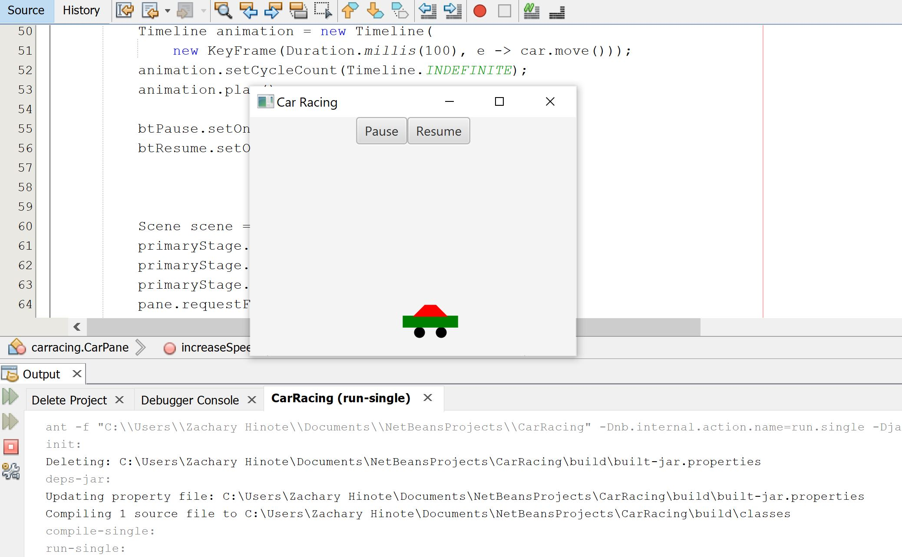

# Exercise 15.29 Racing Car

The project was to make a car graphic move across a pane with two buttons and a key event. 
The first button was to pause the animation. The second button was to resume the animation. 
The key event is meant to be triggered by the up and down arrow keys, to speed up and slow down the car, respectively.

## Example Output

This image will display as your example output. Name the image README.jpg in your project folder.

## Analysis Steps

The problem was to display a race car with buttons to pause the program and resume it's travel, as well as a key press prompt to speed up and slow down the car. 

First I needed to arrange the stage to display buttons and hold a place for the car, then I needed to shape the car out of a polygon, rectangle, and two circles, then I needed to set it to move, 
then I needed to set up a barrier so that it'd shift direction when it hit a wall, and then I needed to set up handlers to handle the buttons pausing the animation and resuming it, 
then I needed to set up a handler to change the barrier variable to match the width of the stage, and finally I needed to set up a handler to use the up and down buttons to increase and decrease the car's speed. 

### Design

How did you approach your program design? Did you use multiple classes to define various objects?

I broke the program down into pieces, and used methods such as increaseSpeed, decreaseSpeed, and move to shift the car graphic. 

### Testing

A step by step series of examples that you developed to properly test the program. 

1. Start the program. 
2. Test the button to increase the Car's speed numerous times and hold it down. 
3. Test the button to decrease the Car's speed numerous times and hold it down. 
4. Test the Pause and Resume buttons by clicking on them.  

End with an example of getting some data out of the system or using it for a little demo

## Notes

Explain any issues or testing instructions.

## Do not change content below this line
## Adapted from a README Built With

* [Dropwizard](http://www.dropwizard.io/1.0.2/docs/) - The web framework used
* [Maven](https://maven.apache.org/) - Dependency Management
* [ROME](https://rometools.github.io/rome/) - Used to generate RSS Feeds

## Contributing

Please read [CONTRIBUTING.md](https://gist.github.com/PurpleBooth/b24679402957c63ec426) for details on our code of conduct, and the process for submitting pull requests to us.

## Versioning

We use [SemVer](http://semver.org/) for versioning. For the versions available, see the [tags on this repository](https://github.com/your/project/tags). 

## Authors

Zachary Hinote

See also the list of [contributors](https://github.com/your/project/contributors) who participated in this project.

## License

This project is licensed under the MIT License - see the [LICENSE.md](LICENSE.md) file for details

